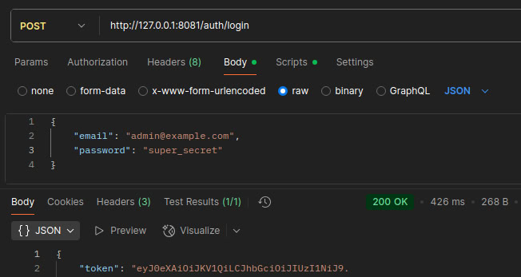
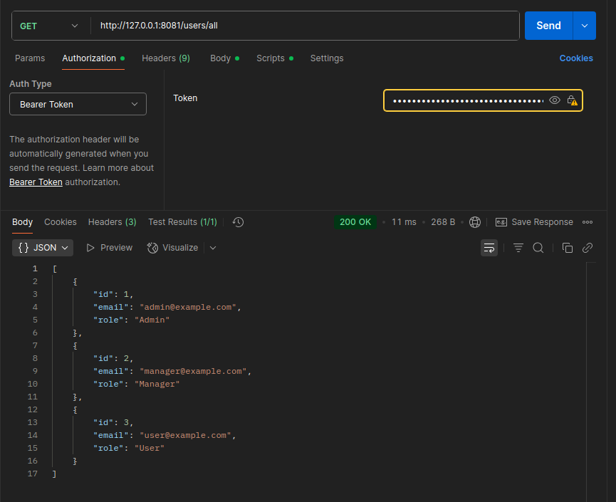
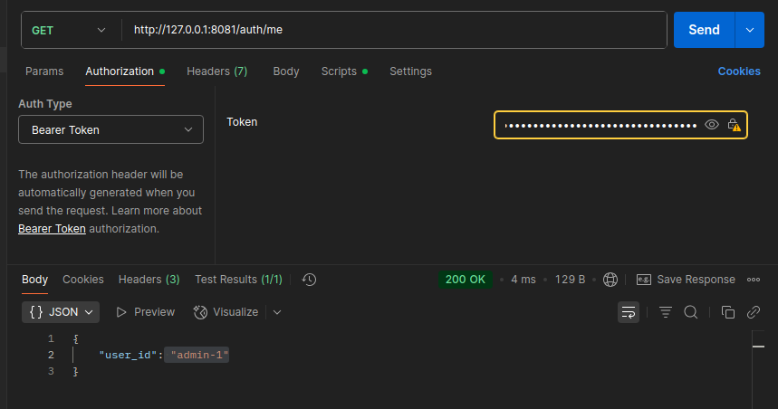
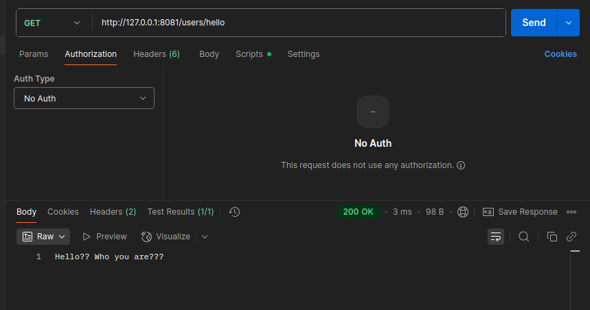
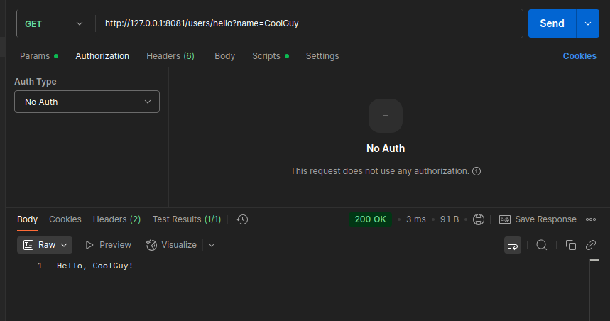
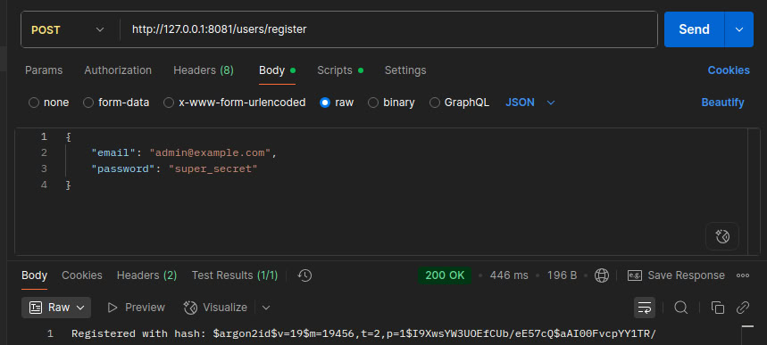

# Actix REST Server
A small server to test basic functionality

## Content
* [General info](#general-info)
* [Demonstration](#demonstration)
* [Technologies](#technologies)
* [Plans](#plans)
* [Setup](#setup)
---

## General info
In order to familiarise myself with backend writing, encryption, administration and Rust in general - this mini project was made.

---

## Demonstration
I will now try to show you some of the functionality at the moment!

1) For example, we can generate a token by entering our email address and password!
 


2) With the necessary role, namely Admin or Manager, we can obtain a list of all users if we have previously generated a token.



3) With the token, we can retrieve our user's name!
 


4) To check the functionality of our server, we can receive a ‘Hello!’ message from it.
  


5) If we want, we can get a more personalised greeting!
 


6) We can also register a user - at the end we will get their hash!



---

## Technologies
Made a project using:
* Rust
* Actix-web
* Serde
* Validator
* argon2
* jsonwebtoken
  
---

## Plans

✅ User Registration

✅ User Authentication

✅ User Information Route

✅ User Roles

✅ Splitting Code into Modules

✅ Working with Application State

❌ Database

❌ API documentation 

❌ Deploy

❌ CORS

❌ Testing

---

## Setup
Either download the latest release or:
```
git clone https://github.com/Andezion/ActixRESTServer.git
cd ActixRESTServer
```
